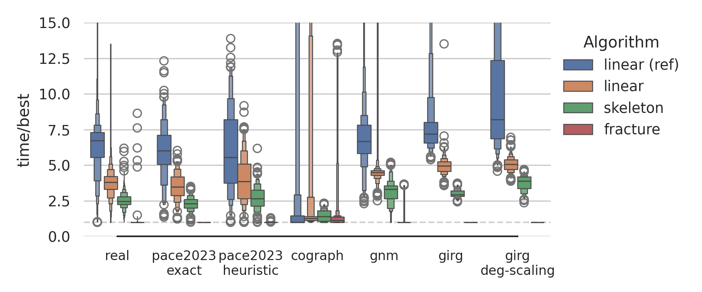

# Modular Decomposition

A library to compute the [modular decomposition](https://en.wikipedia.org/wiki/Modular_decomposition) of a
simple, undirected graph.

[](https://docs.rs/modular-decomposition) [](https://crates.io/crates/modular-decomposition) [](./LICENSE)

This project implements several algorithms for computing the modular decomposition and evaluates them. It is structures as follows.

**Library**
+ [`crates/modular-decomposition`](./crates/modular-decomposition/README.md) A crate providing the `fracture` algorithm based on [[HPV99]](https://doi.org/10.1142/S0129054199000125) and [[CHM02]](https://doi.org/10.46298/dmtcs.298) as a [library](https://crates.io/crates/modular-decomposition).

**Algorithms**
+ `crates/linear-ref-sys`/`crates/linear-ref` Bindings and wrapper to reference C++ implementation [[Miz23]](https://github.com/mogproject/modular-decomposition) based on [[TCHP08]](https://doi.org/10.1007/978-3-540-70575-8_52).
+ `crates/linear` Rust port of [[Miz23]](https://github.com/mogproject/modular-decomposition) based on [[TCHP08]](https://doi.org/10.1007/978-3-540-70575-8_52).
+ `crates/skeleton` Based on [[MS00]](https://doi.org/10.46298/dmtcs.274).
+ `crates/fracture` Based on [[HPV99]](https://doi.org/10.1142/S0129054199000125) and [[CHM02]](https://doi.org/10.46298/dmtcs.298). Uses the implementation in `crates/modular-decomposition`.

**Others**
+ `crates/common` Common utilities shared by the algorithm crate
+ `crates/playground` A crate to experiment with related algorithms and data structures.
+ `crates/evaluation` Evaluation of the algorithms on real-world and generated data.

## Usage

The crate `crates/modular-decomposition` provides an API to compute the modular decomposition.

```rust
use petgraph::graph::UnGraph;
use modular_decomposition::{ModuleKind, modular_decomposition};

let graph = UnGraph::<(), ()>::from_edges([(0, 1), (1, 2), (2, 3)]);
let md = modular_decomposition(&graph)?;

assert_eq!(md.module_kind(md.root()), Some(&ModuleKind::Prime));
```


## Evaluation



This figure shows the algorithm performance for some datasets.
The time for multiple runs is averaged for each instance and algorithm. The time for each algorithm is divided by the best time and the distribution is plotted.
The `fracture` algorithm performs best for most instances.
The evaluation code can be found in `crates/evaluation`.

## References

+ [HPV99] Michel Habib, Christophe Paul, and Laurent Viennot. “Partition Refinement Techniques: An Interesting Algorithmic Tool Kit”. https://doi.org/10.1142/S0129054199000125.
+ [CHM02] Christian Capelle, Michel Habib, and Fabien Montgolfier. “Graph Decompositions and Factorizing Permutations”. https://doi.org/10.46298/dmtcs.298
+ [MS00] Ross M. Mcconnell and Jeremy P. Spinrad. “Ordered Vertex Partitioning”. https://doi.org/10.46298/dmtcs.274
+ [TCHP08] Marc Tedder, Derek Corneil, Michel Habib, and Christophe Paul. “Simpler Linear-Time Modular Decomposition Via Recursive Factorizing Permutations”. https://doi.org/10.1007/978-3-540-70575-8_52.
+ [Miz23] https://github.com/mogproject/modular-decomposition
+ [Kar19] https://github.com/StefanKarpinski/GraphModularDecomposition.jl
